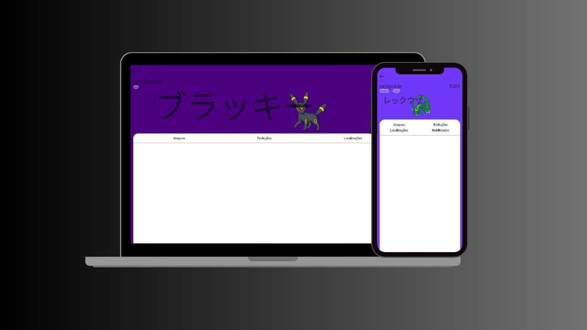

 <h1>Pokedex</h1>
 

  Este é um projeto de uma Pokedex responsiva que exibe informações sobre 778 pokémons. O site é construído para ser acessível em diversos dispositivos, oferecendo uma experiência de usuário fluída e interativa.   Durante o desenvolvimento deste projeto, que ocorreu durante a formação de JavaScript da DIO, aprendi mais sobre JavaScript e como consumir APIs usando Fetch, permitindo a integração e exibição dinâmica dos dados dos pokémons 🚀.
 

 <h2>Tecnologias usadas:</h2>
 <ul>
  <li>HTML</li>
  <li>CSS(responsivo)</li>
  <li>JavaScript</li>
  <li>Fetch API</li>
  <li>Node.js (para host local)</li>
 </ul>
 
 O Node.js foi utilizado apenas para hospedar o site de forma local durante o desenvolvimento.

  
 
Interface inicial

 
  
 
interface de visualização do pokemon

 
